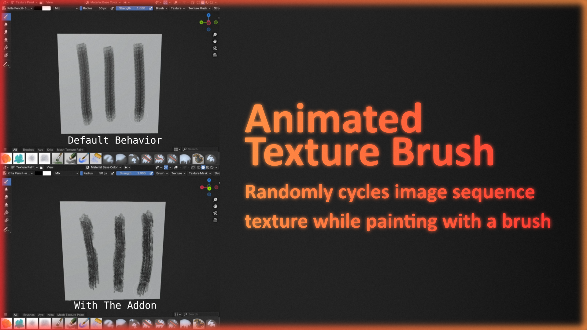

  
  

Animated Brush Add-on enhances Blender’s texture painting workflow by adding random frame cycling for image sequence brush textures. It supports two main modes:
- Continuous: frames cycles in real time while painting, creating a smooth animated effect.
- Per Stroke: frames cycles once at the start of each stroke for better control.

Benefits:
- Natural Variation: break the repetitive look of the default brushes by introducing subtle changes randomly.
- Perfect for Hand-Painted Textures, especially useful for organic surfaces like dirt, foliage, rocks, or stylized textures.

Requirements:
- Texture paint brush using an image sequence texture (4+ frames recommended for best effect).
- Brush texture or brush mask texture can be used.
- The add-on must be enabled in Blender Preferences.

How to Add Sequence Texture to a Brush:
1. Enable the add-on in Blender Preferences → Add-ons.
2. Select an Object → switch to Texture Paint mode.
3. In the Properties Tab → Texture → Brush/Brush Mask → New → Open.
4. Locate your image sequence → Select All → Open Image.
5. In the Properties Tab → Tool → Texture/Texture Mask → Select the Created Texture.

How to Install:
- Drag and Drop the Zip file to Blender (animated_brush.zip) → Press OK.

Tested on Blender 4.4 and newer

Enjoy Painting!!!
