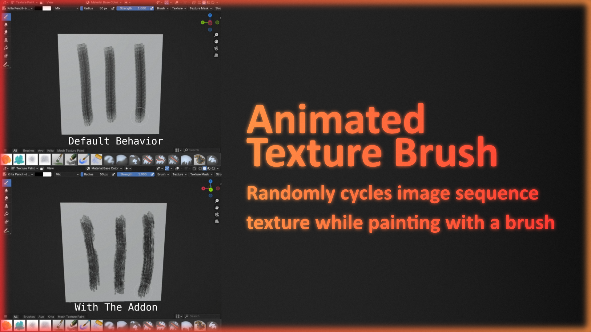

# Animated Texture Brush for Blender

  
  
  
  

**Animated Texture Brush** improves Blender's Texture Paint, Sculpt, Vertex Paint, and Image Editor Paint workflows by varying an existing brush using an image sequence while you paint.

Choose how the sequence advances, when frames change, and whether the animation affects the brush texture, mask, or both.

Also available directly from [Blender Extensions](https://extensions.blender.org/add-ons/animated-brush/).

## Features

- **Random** Select a sequence frame at random.
- **Ordered** Advance through the frames in order, then loop back to the beginning.
- **Ping-Pong** Advance forward and then backward without repeating the endpoints.
- **No Repeat** Prevent consecutive duplicate selections in Random mode when more than one frame is available.
- Animate the **brush texture**, **mask**, or **both**.
- **Continuous** Change frames while drawing a stroke.
- **Per Stroke** Select a new frame when each stroke begins.
- Supports:
  - Texture Paint
  - Sculpt
  - Vertex Paint
  - Image Editor Paint

## Getting Started

1. Create or use a brush with an existing **Image Texture** set to **Image Sequence** and a positive **Frames** value.

   Configure the image sequence and its local image paths normally in Blender.

2. Enable **Animated Texture Brush** from the Tool sidebar or the extension preferences.

   Controls are also available in the **Properties Editor → Tool** tab for supported 3D paint modes.

3. Choose your:
   - **Cycle Mode**
   - **Frame Order**
   - **Animate Target**

For predictable frame changes between separate strokes, use **Per Stroke** together with **Ordered** or **Ping-Pong**.

## Continuous Mode & Timing

Continuous mode is **time-based** rather than advancing exactly once per painted stamp.

Because of this:

- Visible brush stamps may skip or repeat frames.
- Blender's native Image Editor texture caching may keep the first sampled frame for part or all of a stroke.
- **No Repeat** applies to frame selections and does not guarantee that every visible painted stamp will look different.

## Installation

### Blender Extensions

Get the add-on from [Blender Extensions](https://extensions.blender.org/add-ons/animated-brush/) and search for **Animated Texture Brush**.

### GitHub Release

1. Download the [latest release ZIP](https://github.com/Kvendy-an/Animated-Texture-Brush-For-Blender/releases).
2. Drag and drop the ZIP file into Blender.
3. Press **OK** to install it.

## Free Animated Brush Packs

To make getting started easier, I've made **two free brush packs** containing **200+ high-quality draw, smear, and stamp brushes** combined. You can get both from [Gumroad](https://kvendy.gumroad.com).

  
  

- [**Ayo Brushpack**](https://kvendy.gumroad.com/l/bhnjmo/)
- [**Aquarelle Brushpack, New!**](https://kvendy.gumroad.com/l/xtfnny/)

---

**Tested on Blender 5.0 and newer.**

Enjoy painting!
